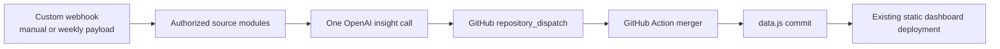

# Dashboard Refresh Data Contract

## Intent

The Make scenario sends **one structured payload** to GitHub after collecting every currently authorized source and generating one insight. GitHub runs the checked-in merger script against the current `data.js`. Therefore, a source failure can never replace a displayed metric with `0`, `null`, an empty string, or an absent object.

| Payload element | Required | Purpose |
| --- | ---: | --- |
| `run.trigger` | Yes | `weekly` or `manual`; recorded for audit only. |
| `run.requested_at` | Yes | ISO 8601 UTC timestamp captured by Make. |
| `run.make_execution_id` | No | Make execution identifier when available. |
| `sources.<source>.status` | Yes | `success`, `partial`, `unavailable`, or `failed`. |
| `sources.<source>.metrics` | Only for `success`/`partial` | Current-period numeric/string values that conform to the field map. |
| `sources.<source>.reason` | No | Safe operational reason for a stale source; no secrets. |
| `insight.status` | Yes | `success` or `failed`. |
| `insight.content` | Only for `success` | One OpenAI response containing the prescribed compact JSON. |

## Stale-data policy

A metric changes **only** when its owning source has `status: "success"` or `"partial"` *and* it contains a finite value for the mapped field. Every other existing value is retained exactly. The merger records a source as `fresh`, `partial`, or `stale`; `unavailable` and `failed` are both represented as `stale` in the dashboard, with the reason retained for operational review.

| Condition | Stored metric value | Dashboard provenance |
| --- | --- | --- |
| Source success and valid metric | Replace with new value; append history only for mapped historical measures | `fresh` |
| Source partial and valid metric | Replace only supplied valid values | `partial`; unsupplied values remain unchanged |
| Source unavailable | Keep all prior values | `stale` |
| Source/API/module failure | Keep all prior values | `stale` |
| Non-finite, empty, or unmapped value | Keep prior value | `partial` if source otherwise succeeded, otherwise `stale` |
| Invalid or failed OpenAI response | Keep prior generated insight | `stale` insight |

> **No zero fallback exists.** A genuine zero is accepted only where the source explicitly sends the numeric value `0` for a mapped metric.

## Refresh flow

The Make scenario remains an immediate Custom Webhook scenario so a person can request a refresh at once. A scheduled GitHub Actions call posts to the same endpoint once per week. It uses the repository’s existing GitHub delivery path only; it creates no hosting service, storage system, database, spreadsheet, reporting tool, or second Make scenario.

## Cost envelope

Each enabled source contributes one Make operation for its source call, followed by one OpenAI module operation and one GitHub dispatch operation. The Custom Webhook reception and routing do not require a second scenario. The GitHub Action performs the data merge without an additional Make operation. Disabled or unavailable source modules must not be enabled merely to return placeholder zeroes.

## References

[1] [Make Help Center — Webhooks](https://help.make.com/webhooks)
[2] [GitHub Docs — Events that trigger workflows](https://docs.github.com/actions/writing-workflows/choosing-when-your-workflow-runs/events-that-trigger-workflows)
